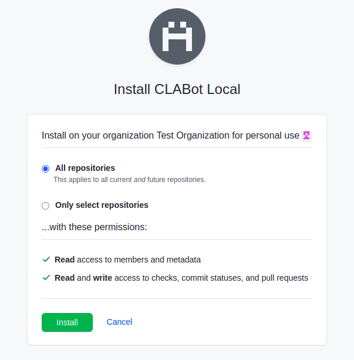

# First time setup

The service requires:

- an instance of EdgeDB with a configured database
- a pull request web hook configured in the desired GitHub account
- a GitHub application configured with necessary rights
- a OAuth application to handle users' sign-in

## EdgeDB configuration

1. Connect to an instance of EdgeDB
2. Create a database called "cla"

```
create database cla;

\c cla
```

3. Execute the script provided in `migrations/structure.edgeql` file to
   initialize the database.

Configure the EdgeDB server instance host, user, and password in the `.env`
file as `EDGEDB_HOST`, `EDGEDB_USER`, and `EDGEDB_PASSWORD` settings.

## Configuring the PR web hook

Create an [organization webhook](https://developer.github.com/v3/orgs/hooks/)
to notify the CLA-bot service of pull request events.

Configure the payload URL to match this pattern:
`https://{INSTANCE_DOMAIN}/api/pullrequesthook`.
Select the radio button _Let me select individual events._, and check
_Pull requests_ events. Ensure that the webhook is active.

## GitHub app configuration

The service requires a GitHub app to interact with PR statuses and comments.
Configure a GitHub app under account `Settings > Developer settings` having
the following permissions:

- Members `Read only` (used during admins' sign-in, under _Organization permissions_)
- Commit statuses `Read & write`
- Pull requests `Read & write`
  and required metadata (automatically set by GitHub UI).

Then, a private RSA key must be generated and downloaded to be used by the CLA-Bot.
The private RSA key is read from file system, and its path is
configured as environmental variable `GITHUB_RSA_PRIVATE_KEY`, in the `.env`
file.

Finally, install the GitHub App onto the organization. Grant access
to all repositories (although, the CLA-Bot supports also access to specific repositories).



## OAuth app configuration

The service requires an OAuth application to enable sign-in for contributors
and administrators through GitHub. A new OAuth application can be configured
under GitHub account `Settings > Developer settings > OAuth Apps`.

The application is assigned automatically a Client ID and Client Secret. These
values are used by the web service to implement OAuth flows, and must be
configured in the `.env` file as `GITHUB_OAUTH_APPLICATION_ID`
and `GITHUB_OAUTH_APPLICATION_SECRET` settings.

_Homepage URL_ should be configured to a company page that describes
the owner of the OAuth application. However, this value is irrelevant
for the CLA-bot service.

_Authorization callback URL_ must be configured to the root URL where the
CLA-Bot service will be served. It is important to configure this value as
the root of the web application because the same OAuth app is used at different
paths, to implement sign-in of both administrators and contributors.
For example, if an OAuth application is configured for local development, its
authorization callback URL could be _http://localhost:3000/_.

Since the OAuth settings require the URL where a user is redirected after login,
configure in `.env` file the base URL of the service as `SERVER_URL`. For
example, if an instance in `edbcloud` is published at:

- http://edbcloud-roberto-cla-1134086323.us-east-2.elb.amazonaws.com

This value must be configured as `SERVER_URL`.

## Application settings

The following table describes the application settings required by the service.
These can be either configured as environmental variables, or `.env` file at
the application root folder.

| Name                            | Description                                                             | Example value         |
| ------------------------------- | ----------------------------------------------------------------------- | --------------------- |
| EDGEDB_HOST                     | EdgeDB host                                                             | 127.0.0.1             |
| EDGEDB_USER                     | EdgeDB user                                                             | edgedb                |
| EDGEDB_PASSWORD                 | EdgeDB password                                                         | \*\*\*\*\*\*\*\*      |
| GITHUB_APPLICATION_ID           | GitHub application id                                                   | 12327                 |
| GITHUB_RSA_PRIVATE_KEY          | File path to the private RSA key of the GitHub application              | example.pem           |
| GITHUB_OAUTH_APPLICATION_ID     | Id of the OAuth application used for users' sign-in                     | 30cd618b8740eb66a95c  |
| GITHUB_OAUTH_APPLICATION_SECRET | Secret of the OAuth application used for users' sign-in                 | 12310928301920asd9123 |
| SERVER_URL                      | URL to the root of the web service itself, this is used for OAuth flows | https://myorg-cla.com |
| SECRET                          | Secret used to generate and validate JWTs issued by the web service     | https://myorg-cla.com |
| ORGANIZATION_NAME               | Name of the organization                                                | edgedb                |

## GitHub webhooks require public endpoints

During local development, it is recommended to use [`ngrok`](https://ngrok.com/)
to create a tunnel and use public endpoints provided by this tool. This tool
is also recommended by GitHub. If a paid license is available, it's possible
to use a fixed DNS name, which is convenient to configure only once the
redirect URI for the OAuth application, the web hook for pull requests,
and `SERVER_URL` application setting.

For example, if a subdomain `eg-edgedb` is reserved with ngrok, run ngrok with
this command:

```
ngrok http 3000 -subdomain=eg-edgedb
```

In such scenario, the GitHub web hook would be configured with this value:

- `https://eg-edgedb.ngrok.io/api/pullrequesthook`

While the OAuth authorization URL can still use localhost to enable faster
development.

## Useful links

- https://www.npmjs.com/package/client-oauth2
- https://www.npmjs.com/package/client-oauth2#authorization-code-grant

## Next steps

To configure an instance in `edbcloud`, see the instructions at
[edgedb-cloud.md](./edgedb-cloud.md).
