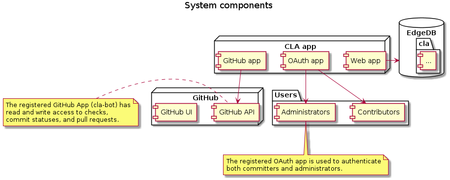
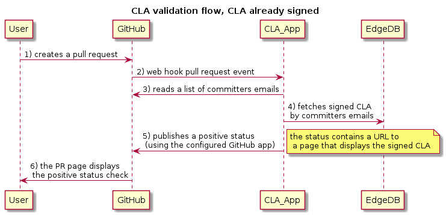
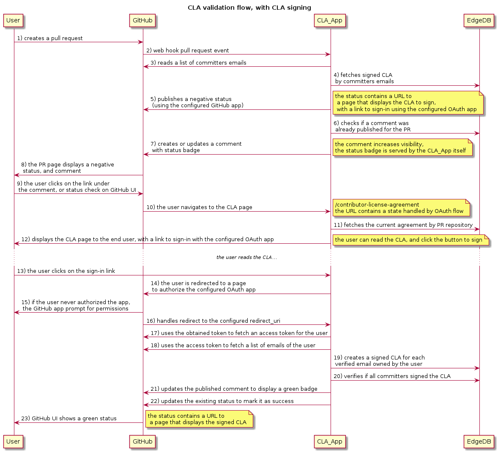

## System components

## CLA validation flow with CLA already signed

## CLA validation flow with CLA signing

----

## About PlantUML diagrams
This folder contains [PlantUML diagrams](https://plantuml.com) used to document this project.

To render the source diagrams into pictures, it is possible to install the required tools this way:
* install a Java runtime
* install PlantUML extension by `jebbs` for VS Code
* install [Graphviz](https://graphviz.org/download/), or download an executable and make it accessible to $PATH
* open a diagram file (`.wsd`)
* use Alt-D to preview the current diagram in VS Code
* export using right-click on the diagram file
